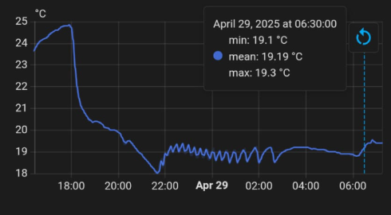
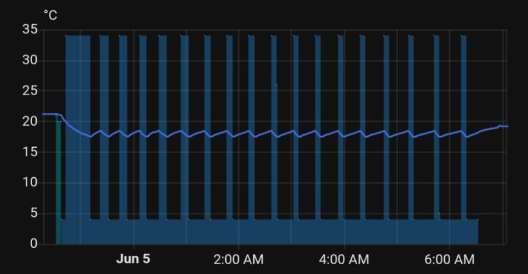

# ESP32 Airco NTC Spoofer

An ESP32-C3 based open-hardware controller for improving the temperature regulation of a portable air conditioner by taking control of its NTC temperature-sensor input.

Instead of switching mains power or directly controlling the compressor, this project leaves the air conditioner's own electronics in charge and changes only the temperature resistance presented to its NTC input.

## Project goal

The goal of this project is to make a portable air conditioner regulate the temperature of the **room**, rather than relying only on the temperature measured by the air conditioner's built-in NTC sensor.

In my installation, the stock NTC measurement did not represent the room temperature very well. The temperature could continue drifting significantly after the air conditioner had started cooling, resulting in poor regulation and noticeable overshoot.

### Stock NTC

The following trace shows the system operating with the original air-conditioner NTC control.



The built-in control reacts to the temperature measured at the air conditioner itself. Depending on the unit, airflow, sensor placement, and room layout, that temperature can differ substantially from the temperature at the location that actually matters.

### With the NTC spoofer

The following trace shows the same air conditioner being controlled through the ESP32 NTC spoofer.



With the spoofer active, a Home Assistant room-temperature sensor becomes the input for an ESPHome thermostat.

The air conditioner is then deliberately shown one of two simulated NTC temperatures:

```text
35 °C -> cooling required
5 °C  -> target satisfied
```

The large transitions in the second graph are therefore intentional. They are the simulated NTC temperatures used to make the air conditioner's own controller start or stop requesting cooling.

The actual room-temperature trace can then be regulated using the external room sensor instead of depending on the location of the air conditioner's internal NTC.

These plots are examples from my installation rather than a controlled laboratory A/B test, but they illustrate the problem this project is intended to solve.

## How it works

The PCB sits between the air conditioner's original NTC sensor and the air-conditioner controller.

It can present one of three states:

```text
                         +----------------------+
Original NTC ------------|                      |
                         |  ESP32 NTC Spoofer   |----> Air-conditioner NTC input
39 kΩ / ~5 °C -----------|                      |
                         |                      |
10 kΩ / ~35 °C ----------|                      |
                         +----------------------+
                                   ^
                                   |
                              XIAO ESP32-C3
```

The ESP32 does **not** directly control the compressor.

The portable air conditioner's original controller still handles:

- compressor operation;
- internal compressor protection;
- fan behaviour;
- fault handling;
- the rest of the normal air-conditioner control logic.

The ESP32 only changes the temperature resistance seen at the NTC input.

## Control principle

The ESPHome firmware receives the room temperature and air-conditioner state from Home Assistant.

When cooling is required:

```text
Room too warm
    |
    v
ESPHome thermostat -> COOL
    |
    v
35 °C spoof selected
    |
    v
Air conditioner sees a warm NTC
    |
    v
Air conditioner continues cooling
```

When the target temperature has been reached:

```text
Target satisfied
    |
    v
ESPHome thermostat -> IDLE
    |
    v
5 °C spoof selected
    |
    v
Air conditioner sees a cold NTC
    |
    v
Air conditioner stops requesting cooling
```

When external control is inactive, the original NTC is reconnected.

## Hardware fail-safe

The PCB is designed so that loss of control power returns the NTC interface to the original sensor path:

```text
Original NTC -> connected
5 °C spoof   -> disconnected
35 °C spoof  -> disconnected
```

The original NTC path uses normally-closed PhotoMOS relays, while the spoof paths use normally-open PhotoMOS relays.

This means the hardware falls back to the air conditioner's own sensor when the controller is not powered.

## GPIO mapping

The corrected PCB and firmware mapping is:

| XIAO ESP32-C3 | GPIO | Function |
|---|---:|---|
| D2 | GPIO4 | Original air-conditioner NTC path |
| D3 | GPIO5 | 5 °C spoof path / 39 kΩ |
| D4 | GPIO6 | 35 °C spoof path / 10 kΩ |

The resistor values and firmware GPIO mapping must agree with the PCB.

## Firmware

Two ESPHome configurations are included.

### Two-room version

[`firmware/esp32-airco-ntc-spoofer-double-room.yaml`](firmware/esp32-airco-ntc-spoofer-double-room.yaml)

Supports two Home Assistant room-temperature sensors and an `Airco Area` selector:

```text
None
Room 1
Room 2
```

This version preserves the behaviour of the original two-room firmware.

### Single-room version

[`firmware/esp32-airco-ntc-spoofer-single-room.yaml`](firmware/esp32-airco-ntc-spoofer-single-room.yaml)

Uses one fixed Home Assistant room-temperature sensor and contains additional software fail-safe checks.

For the complete firmware explanation, configuration instructions, diagrams, thermostat behaviour, and compressor timing procedure, see:

**[Firmware documentation](firmware/firmware.md)**

## Hardware

The repository includes the complete PCB design and manufacturing files:

- EasyEDA schematic source;
- EasyEDA PCB source;
- schematic PDF;
- PCB PDF;
- Gerbers;
- BOM;
- pick-and-place file;
- OBJ mechanical model.

For PCB details, component information, manufacturing settings, and hardware verification, see:

**[Hardware documentation](hardware/hardware.md)**

## Repository structure

```text
ESP32-Airco-NTC-Spoofer/
├── README.md
├── LICENSE.md
├── LICENSES/
│   ├── CERN-OHL-S-2.0.txt
│   └── GPL-3.0-only.txt
│
├── images/
│   ├── stock-ntc-temperature.png
│   └── ntc-spoofer-temperature.png
│
├── firmware/
│   ├── firmware.md
│   ├── esp32-airco-ntc-spoofer-double-room.yaml
│   ├── esp32-airco-ntc-spoofer-single-room.yaml
│   ├── secrets.example.yaml
│   └── docs/
│
└── hardware/
    ├── hardware.md
    ├── assembly/
    ├── bom/
    ├── docs/
    ├── easyeda/
    ├── gerbers/
    └── mechanical/
```

## Getting started

A typical build consists of:

1. Manufacture and assemble the PCB using the files in [`hardware/`](hardware/).
2. Verify the original NTC fallback path before connecting the board to the air conditioner.
3. Connect the original NTC to `NTC_IN`.
4. Connect `NTC_OUT` to the air conditioner's NTC input.
5. Power the controller according to the schematic.
6. Choose the single-room or two-room ESPHome configuration.
7. Configure the Home Assistant entity IDs and ESPHome secrets.
8. Compile and flash the XIAO ESP32-C3.
9. Verify the 5 °C, 35 °C, and original-NTC states.
10. Observe several normal cooling cycles before relying on the system unattended.

See the [firmware documentation](firmware/firmware.md) and [hardware documentation](hardware/hardware.md) for the detailed procedure.

## Compressor cycling

Because this project adds an external thermostat in front of the air conditioner's own control system, the ESPHome thermostat includes minimum ON and OFF times.

The default configuration is:

```yaml
min_off_time: "4min"
min_on_time: "6min"
min_idle_time: "0s"
```

These values should be checked against the behaviour and documentation of the air conditioner being controlled.

The firmware documentation contains a practical procedure for measuring normal compressor cycling with a power-monitoring smart plug:

[Compressor timing and tuning](firmware/firmware.md#tuning-min_off_time-and-min_on_time)

## Important limitations

This project is intended for low-voltage NTC sensor interfacing.

It is **not** a mains-power switching project.

Before using the controller:

- verify the NTC connector pinout;
- verify the board-power connector pinout;
- verify the spoof resistances with a multimeter;
- verify that the original NTC is restored when control is inactive;
- verify normal compressor cycling;
- use manufacturer or service-manual protection limits when available.

The resistance-to-temperature relationship is specific to the NTC curve used by the air conditioner. The 39 kΩ and 10 kΩ values are the values used for this particular design and should not automatically be assumed to match every air conditioner.

## Project status

The project contains a working hardware design, manufacturing outputs, and ESPHome firmware for controlling a portable air conditioner through its NTC input.

The current hardware uses:

```text
XIAO ESP32-C3
CPC1117NTR normally-closed PhotoMOS relays
CPC1017NTR normally-open PhotoMOS relays
39 kΩ cold-spoof resistor
10 kΩ warm-spoof resistor
```

If adapting the project to another air conditioner, first determine the NTC resistance curve and verify that the spoof resistance values are appropriate for that unit.

## License

This repository contains separately licensed firmware and hardware.

| Part | License |
|---|---|
| Firmware / software | GNU GPL v3 only (`GPL-3.0-only`) |
| Hardware design | CERN Open Hardware Licence v2 - Strongly Reciprocal (`CERN-OHL-S-2.0`) |

See [LICENSE.md](LICENSE.md) for the licensing overview and [`LICENSES/`](LICENSES/) for the full license texts.
