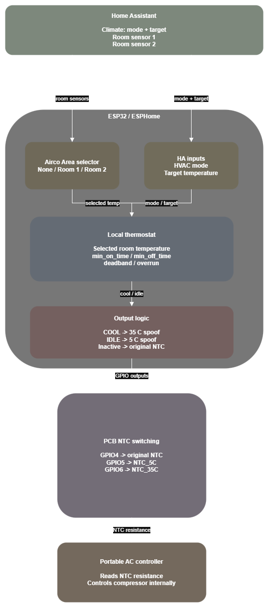
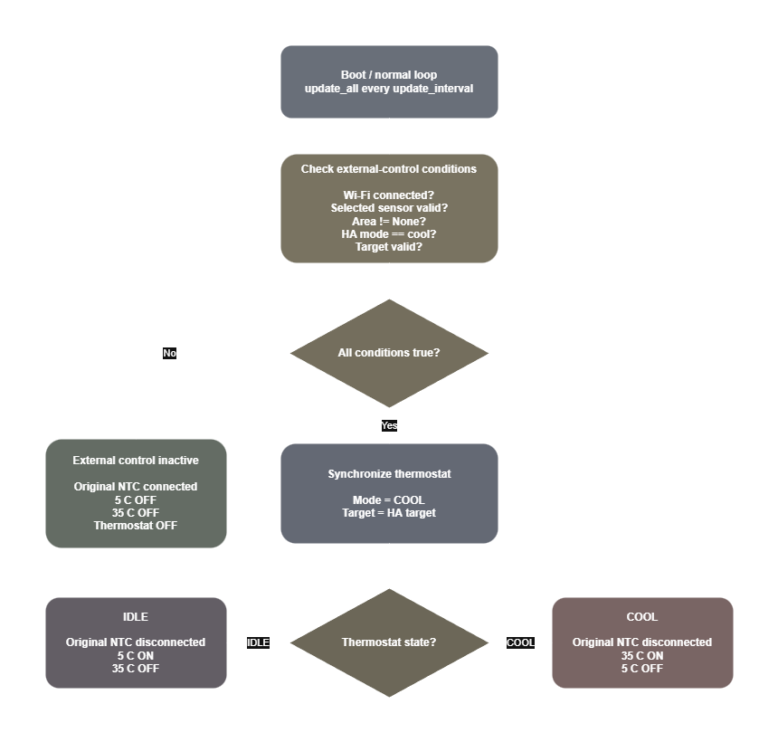
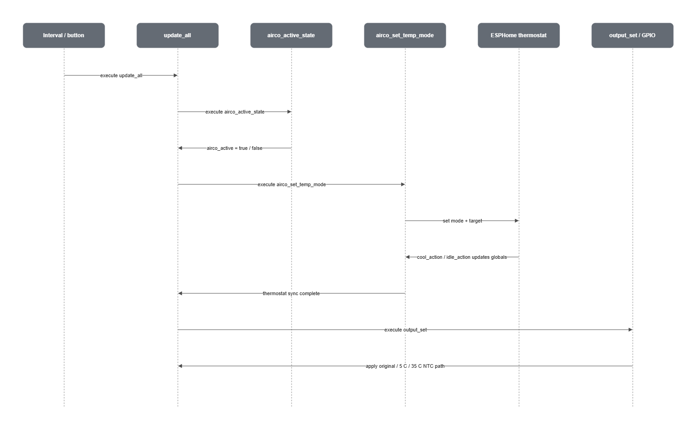

# Firmware

This directory contains the ESPHome firmware for the **ESP32 Airco NTC Spoofer**.

The firmware uses one or more Home Assistant room-temperature sensors together with a Home Assistant climate entity. The ESP32 runs a local thermostat and controls which resistance the portable air conditioner sees on its original NTC temperature-sensor input.

The PCB does **not** directly switch the compressor or the mains supply. The portable air conditioner's own electronics remain responsible for operating and protecting the compressor.

## Contents

- [Two-room firmware](esp32-airco-ntc-spoofer-double-room.yaml)
- [Single-room firmware](esp32-airco-ntc-spoofer-single-room.yaml)
- [Example secrets file](secrets.example.yaml)
- [Editable Draw.io diagrams](docs/firmware-diagrams.drawio)

## Firmware variants

### Two-room configuration

Use:

[`esp32-airco-ntc-spoofer-double-room.yaml`](esp32-airco-ntc-spoofer-double-room.yaml)

This version supports two Home Assistant room-temperature sensors and provides an `Airco Area` selector.

The available selections are:

```text
None
Room 1
Room 2
```

The selected room sensor becomes the temperature input for the local ESPHome thermostat.

This configuration intentionally preserves the control behaviour of the original two-room firmware. Installation-specific names and Home Assistant entity IDs have been moved into `substitutions`, and the corrected GPIO mapping is used.

### Single-room configuration

Use:

[`esp32-airco-ntc-spoofer-single-room.yaml`](esp32-airco-ntc-spoofer-single-room.yaml)

This version is intended for installations with one fixed room-temperature sensor.

It removes:

- the second room sensor;
- the `Airco Area` selector;
- the room-selection logic.

The single-room configuration also contains additional fail-safe checks, including Home Assistant API connectivity and explicit restoration of the original NTC path if the control state becomes invalid.

## Hardware / GPIO mapping

The firmware expects the corrected PCB mapping:

| XIAO ESP32-C3 | GPIO | Function |
|---|---:|---|
| D2 | GPIO4 | Original air-conditioner NTC path |
| D3 | GPIO5 | 5 °C spoof path |
| D4 | GPIO6 | 35 °C spoof path |

The resistor placement and firmware GPIO assignment must agree with this table.

The intended spoof mapping is:

```text
GPIO5 -> NTC_5C  -> cold simulated temperature
GPIO6 -> NTC_35C -> warm simulated temperature
```

## UML diagrams

The firmware diagrams are stored in [`docs/`](docs/).

The editable diagrams.net / Draw.io source is:

[`docs/firmware-diagrams.drawio`](docs/firmware-diagrams.drawio)

### System architecture

The architecture diagram shows how Home Assistant, the ESPHome thermostat, the GPIO outputs, the NTC switching hardware, and the portable air conditioner interact.

[](docs/Firmware-Architecture-Diagram.png)

The important boundary is that the ESP32 does not directly command the compressor. It changes the resistance presented to the air conditioner's NTC input. The air conditioner's own controller still decides when to run the compressor.

### Control-state diagram

The control-state diagram shows the main decisions made by the two-room firmware before NTC spoofing is enabled.

[](docs/Control-State-Diagram.png)

If external control is inactive, the original NTC path is used.

The thermostat states correspond to:

```text
COOL
  -> current_state_ntc_35c = true
  -> current_state_ntc_5c  = false

IDLE
  -> current_state_ntc_5c  = true
  -> current_state_ntc_35c = false
```

### Update sequence

The sequence diagram shows the execution order used by the two-room `update_all` script.

[](docs/Sequence-Diagram.png)

The order is intentionally:

```text
update_all
    |
    +--> airco_active_state
    |
    +--> airco_set_temp_mode
    |
    +--> output_set
```

This matters because `airco_set_temp_mode` can cause the thermostat to update `current_state_ntc_5c` or `current_state_ntc_35c` before `output_set` applies the corresponding GPIO states.

## Operating principle

The original portable air conditioner uses an NTC temperature sensor.

This PCB sits between that sensor and the air-conditioner controller and can present one of three temperature-sensing states:

```text
Original NTC
5 °C spoof
35 °C spoof
```

Conceptually:

```text
                           +-------------------+
Original NTC -------------|                   |
                           | NTC switching PCB |----> Air-conditioner NTC input
5 °C resistor ------------|                   |
                           |                   |
35 °C resistor -----------|                   |
                           +-------------------+
                                    ^
                                    |
                                 ESP32-C3
```

When external control is inactive, the original NTC is used.

When external thermostat control is active, the ESP32 selects either the 5 °C or the 35 °C spoof resistance.

## Thermostat behaviour

Home Assistant supplies:

- the current room temperature;
- the requested HVAC mode;
- the requested target temperature.

The ESP32 runs an ESPHome thermostat using the selected room-temperature sensor.

When the local thermostat requires cooling:

```text
35 °C spoof selected
```

The portable air conditioner sees a warm simulated temperature and therefore continues cooling.

When the target temperature has been satisfied:

```text
5 °C spoof selected
```

The portable air conditioner sees a cold simulated temperature and therefore stops requesting cooling.

The portable air conditioner's own controller remains responsible for actual compressor operation.

## Two-room control flow

The two-room configuration works as follows:

```text
Room 1 sensor -----+
                   |
                   +----> Airco Area selector ----> room_temp
                   |
Room 2 sensor -----+

Home Assistant climate mode --------+
                                     |
Home Assistant target temperature ---+----> ESPHome thermostat
                                     |
room_temp ---------------------------+
```

Configure the installation-specific values under `substitutions`:

```yaml
substitutions:
  device_name: "esp32-airco-ntc-spoofer"
  friendly_name: "ESP32 Airco NTC Spoofer"

  room_1_name: "Living Room"
  room_2_name: "Bedroom"

  room_1_temperature_entity: "sensor.living_room_temperature"
  room_2_temperature_entity: "sensor.bedroom_temperature"

  airco_climate_entity: "climate.portable_air_conditioner"

  update_interval: "5s"

  min_off_time: "4min"
  min_on_time: "6min"
  min_idle_time: "0s"
```

When `None` is selected for `Airco Area`, external NTC spoofing is disabled and the original NTC is used.

### When two-room external control is active

The two-room firmware considers external control active only when all of the following are true:

- Wi-Fi is connected;
- the selected room-temperature sensor contains a valid value;
- `Airco Area` is not `None`;
- the Home Assistant climate entity reports `cool`;
- the Home Assistant target temperature contains a valid numeric value.

These conditions are evaluated by:

```text
airco_active_state
```

The main control loop runs every:

```yaml
update_interval: "5s"
```

by default.

## Single-room control flow

The single-room configuration uses one fixed room sensor:

```text
Room temperature -------------------+
                                    |
Home Assistant climate mode --------+----> ESPHome thermostat
                                    |
Home Assistant target temperature --+
```

Configure it with:

```yaml
substitutions:
  device_name: "esp32-airco-ntc-spoofer"
  friendly_name: "ESP32 Airco NTC Spoofer"

  room_temperature_entity: "sensor.living_room_temperature"
  airco_climate_entity: "climate.portable_air_conditioner"

  update_interval: "5s"

  min_off_time: "4min"
  min_on_time: "6min"
  min_idle_time: "0s"

  cool_deadband: "0.1 °C"
  cool_overrun: "0.35 °C"
```

The single-room version additionally requires an active Home Assistant ESPHome API connection before external spoof control is enabled.

If the required state becomes invalid, the single-room firmware restores:

```text
Original NTC -> connected
5 °C spoof   -> disconnected
35 °C spoof  -> disconnected
```

## NTC output states

### External control inactive

```text
Original NTC -> connected
5 °C spoof   -> disconnected
35 °C spoof  -> disconnected
```

### Cooling requested

```text
Original NTC -> disconnected
5 °C spoof   -> disconnected
35 °C spoof  -> connected
```

### Target satisfied

```text
Original NTC -> disconnected
5 °C spoof   -> connected
35 °C spoof  -> disconnected
```

## Thermostat hysteresis

The firmware uses thermostat hysteresis to prevent excessive switching around the target temperature.

The default settings are:

```yaml
cool_deadband: 0.1 °C
cool_overrun: 0.35 °C
```

For a target of:

```text
22.0 °C
```

cooling begins at approximately:

```text
22.0 + 0.1 = 22.1 °C
```

and stops at approximately:

```text
22.0 - 0.35 = 21.65 °C
```

A wider hysteresis generally gives longer cooling cycles and fewer compressor starts.

A narrower hysteresis gives tighter room-temperature regulation but can increase cycling frequency.

## Compressor protection settings

The important thermostat timing settings are:

```yaml
substitutions:
  min_off_time: "4min"
  min_on_time: "6min"
  min_idle_time: "0s"
```

These are passed to the ESPHome thermostat as:

```yaml
min_cooling_off_time: ${min_off_time}
min_cooling_run_time: ${min_on_time}
min_idle_time: ${min_idle_time}
```

### `min_off_time`

`min_off_time` is the minimum amount of time cooling must remain OFF before the thermostat may request cooling again.

Example:

```yaml
min_off_time: "4min"
```

After cooling stops, the external thermostat will not request another cooling cycle for at least four minutes.

This helps prevent rapid compressor restarts.

### `min_on_time`

`min_on_time` is the minimum amount of time cooling must remain active before the thermostat may transition back to idle.

Example:

```yaml
min_on_time: "6min"
```

Once the thermostat requests cooling, it will keep the cooling state active for at least six minutes.

### `min_idle_time`

The default is:

```yaml
min_idle_time: "0s"
```

For this project, compressor restart protection is primarily handled by `min_off_time`.

`min_idle_time` normally does not need to duplicate the same delay unless the installation requires it.

# Tuning `min_off_time` and `min_on_time`

The timing values should be tuned for the portable air conditioner being controlled.

A practical way to estimate suitable values is to connect the portable air conditioner to a **power-monitoring smart-home plug** and observe the compressor's normal ON and OFF cycling.

> [!IMPORTANT]
> The air conditioner must be **actively regulating room temperature** during this measurement.
>
> If the room is much warmer than the setpoint and the compressor simply runs continuously, the measurement does not provide useful minimum ON/OFF cycle information.

> [!CAUTION]
> Manufacturer or service-manual compressor timing requirements take precedence over measurements. Do not configure a shorter protection interval than a documented manufacturer requirement.

## Required equipment

You need:

- the portable air conditioner;
- a power-monitoring smart plug;
- access to the plug's live or historical power graph;
- conditions that allow the air conditioner to repeatedly cycle the compressor ON and OFF.

The smart plug must be rated for the air conditioner's voltage, current, and startup load.

## Why power monitoring works

A portable air conditioner normally has clearly different power consumption when the compressor is running compared with fan-only operation.

Conceptually:

```text
High power  -> compressor running
Lower power -> compressor stopped / fan may still be running
```

The fan may continue running while the compressor is stopped, so compressor OFF does **not** necessarily mean that power consumption falls to zero.

A typical trace may look like:

```text
Power
  ^
  |
  |        +---------------+              +---------------+
  |        |  Compressor   |              |  Compressor   |
  |        |      ON       |              |      ON       |
  |--------+               +--------------+               +------
  |
  |          <--- ON --->     <--- OFF --->   <--- ON --->
  |
  +------------------------------------------------------------> time
```

## Measurement procedure

### 1. Connect the smart plug

Connect the portable air conditioner through the power-monitoring smart plug.

Verify that the smart plug updates frequently enough to distinguish compressor starts and stops.

### 2. Let the air conditioner regulate normally

Set the air conditioner to cooling mode.

Choose a target temperature that allows the room to repeatedly cross the air conditioner's own regulation thresholds.

The desired behaviour is:

```text
compressor ON
      |
      v
room cools
      |
      v
compressor OFF
      |
      v
room warms
      |
      v
compressor ON again
```

If the compressor runs continuously, wait until the room is close enough to the setpoint for the air conditioner to begin regulating.

### 3. Record multiple cycles

Do not base the timing on one cycle.

Record several complete compressor cycles:

| Cycle | Compressor ON time | Compressor OFF time |
|---|---:|---:|
| 1 |  |  |
| 2 |  |  |
| 3 |  |  |
| 4 |  |  |
| 5 |  |  |

Try to keep the room conditions reasonably stable during the measurement.

### 4. Determine the observed OFF time

For each cycle:

```text
OFF time =
next compressor start
-
previous compressor stop
```

Example observations:

```text
4m 20s
3m 55s
4m 05s
3m 47s
4m 11s
```

Shortest observed OFF time:

```text
3m 47s
```

A conservative configuration could be:

```yaml
min_off_time: "4min"
```

### 5. Determine the observed ON time

For each cycle:

```text
ON time =
compressor stop
-
compressor start
```

Example observations:

```text
6m 30s
5m 58s
5m 42s
6m 15s
5m 55s
```

Shortest observed ON time:

```text
5m 42s
```

A conservative configuration could be:

```yaml
min_on_time: "6min"
```

### 6. Update the firmware

Change the values in the YAML:

```yaml
substitutions:
  min_off_time: "4min"
  min_on_time: "6min"
```

Then validate, compile, and flash the ESPHome configuration.

## Important limitation of this measurement method

The smart-plug method measures the air conditioner's **observed normal behaviour**.

It does not necessarily reveal the compressor's absolute internal protection limits.

For example, an observed six-minute compressor ON period may simply mean that the room required six minutes to cross the thermostat threshold. It does not prove that the air conditioner contains a six-minute minimum-run timer.

Likewise, an observed OFF period may contain:

```text
internal compressor protection delay
+
time required for the room temperature to rise
```

For this reason:

- prefer manufacturer or service-manual values when available;
- observe multiple cycles;
- do not deliberately force rapid compressor cycling;
- use conservative values;
- round timings upward rather than downward.

The purpose of the measurement is **not** to find the shortest cycle the compressor can survive.

The purpose is to ensure that the external thermostat does not request cycling faster than the portable air conditioner normally does.

## Recommended tuning workflow

1. Connect the portable air conditioner through a suitable power-monitoring smart plug.
2. Let the air conditioner regulate room temperature using its normal controller.
3. Record several compressor ON periods.
4. Record several compressor OFF periods.
5. Find the shortest repeatable ON and OFF periods.
6. Compare those measurements with the configured ESPHome values.
7. Round conservatively upward.
8. Update `min_on_time` and `min_off_time`.
9. Run the air conditioner with the NTC spoofer controlling it.
10. Compare the new compressor cycle behaviour with the original power trace.

If the NTC spoofer causes substantially more frequent compressor starts than the original air-conditioner thermostat, increase the protection timings and/or thermostat hysteresis.

## Example tuning result

Suppose the original air conditioner produces:

| Cycle | ON time | OFF time |
|---|---:|---:|
| 1 | 7:10 | 4:35 |
| 2 | 6:25 | 4:08 |
| 3 | 5:42 | 3:47 |
| 4 | 6:05 | 4:12 |
| 5 | 5:51 | 3:55 |

The shortest observed values are:

```text
ON  = 5m 42s
OFF = 3m 47s
```

A conservative configuration could therefore be:

```yaml
substitutions:
  min_off_time: "4min"
  min_on_time: "6min"
```

## Secrets

Do not commit real Wi-Fi credentials, API encryption keys, OTA passwords, or local network configuration to the public repository.

Use ESPHome's `secrets.yaml`.

An example template is included:

[`secrets.example.yaml`](secrets.example.yaml)

Example:

```yaml
wifi_ssid: "YOUR_WIFI_SSID"
wifi_password: "YOUR_WIFI_PASSWORD"

api_encryption_key: "YOUR_API_ENCRYPTION_KEY"
ota_password: "YOUR_OTA_PASSWORD"

# Required by the current two-room configuration:
device_static_ip: "192.168.1.50"
gateway_ip: "192.168.1.1"
subnet: "255.255.255.0"
```

The single-room configuration uses DHCP by default. Its optional static-IP block can be enabled if required.

## Commissioning checklist

Before relying on the controller unattended:

- [ ] Verify the correct resistor is fitted to the 5 °C path.
- [ ] Verify the correct resistor is fitted to the 35 °C path.
- [ ] Verify GPIO5 controls `NTC_5C`.
- [ ] Verify GPIO6 controls `NTC_35C`.
- [ ] Verify the original NTC operates correctly when spoof control is inactive.
- [ ] Verify the 5 °C spoof produces the expected air-conditioner response.
- [ ] Verify the 35 °C spoof produces the expected air-conditioner response.
- [ ] Verify the configured Home Assistant room-temperature sensor is correct.
- [ ] For the two-room configuration, verify both `Airco Area` selections.
- [ ] Verify the Home Assistant target temperature is imported correctly.
- [ ] Verify the Home Assistant HVAC mode is imported correctly.
- [ ] Measure several normal compressor ON/OFF cycles.
- [ ] Tune `min_off_time` and `min_on_time`.
- [ ] Observe several complete cycles with the NTC spoofer active.
- [ ] Verify the expected fallback behaviour before unattended use.

## ESPHome reference

ESPHome thermostat documentation:

<https://esphome.io/components/climate/thermostat/>

## License

The firmware in this directory is licensed under the
**GNU General Public License version 3 only (GPL-3.0-only)**.

See [GPL-3.0-only.txt](../LICENSES/GPL-3.0-only.txt).